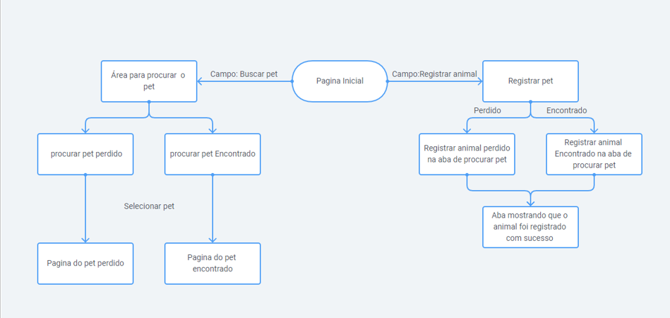
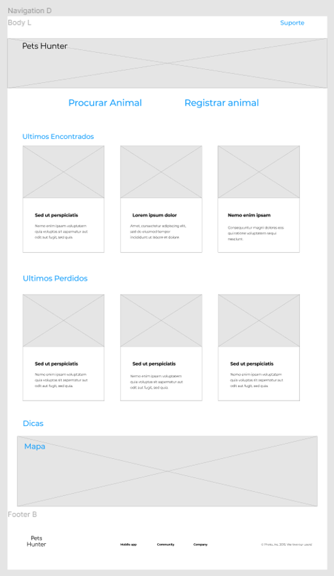
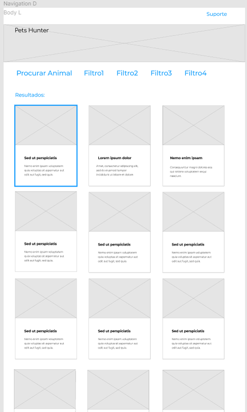
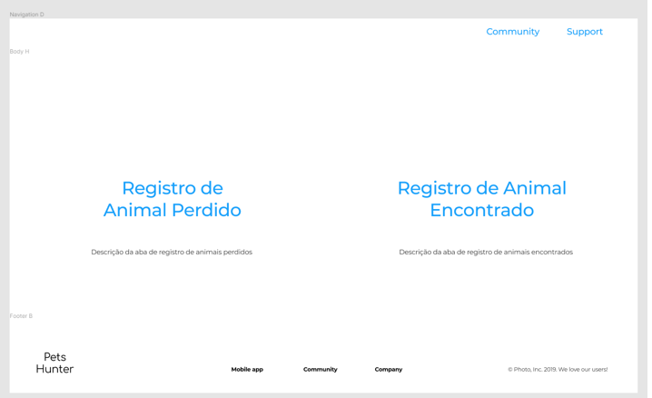
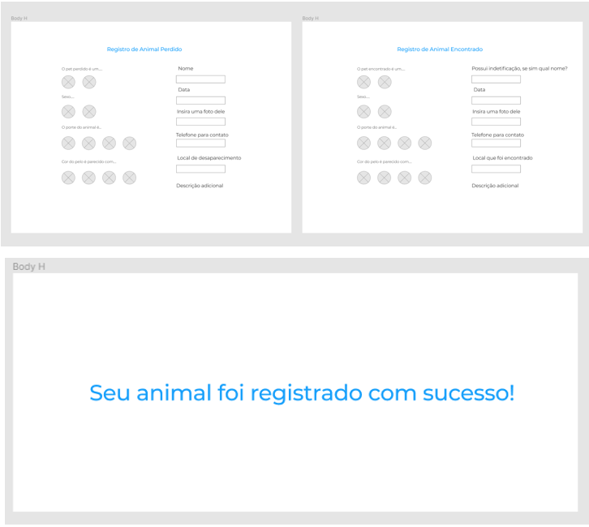

# Informações do Projeto
`TÍTULO DO PROJETO`  

Pets Hunter

`CURSO` 

Curso de Engenharia de Software 

## Participantes

> Os membros do grupo são: 
> - Luiz Gustavo Mendes Santos            
> - Amanda Moura de Souza	
> - João Gabriel Perez Monteiro	         
> - Lucas Carvalho Peres 	
> - Pedro Lucas Machado Santos         

# Estrutura do Documento

- [Informações do Projeto](#informações-do-projeto)
  - [Participantes](#participantes)
- [Estrutura do Documento](#estrutura-do-documento)
- [Introdução](#introdução)
  - [Problema](#problema)
  - [Objetivos](#objetivos)
  - [Justificativa](#justificativa)
  - [Público-Alvo](#público-alvo)
- [Especificações do Projeto](#especificações-do-projeto)
  - [Personas e Mapas de Empatia](#personas-e-mapas-de-empatia)
  - [Histórias de Usuários](#histórias-de-usuários)
  - [Requisitos](#requisitos)
    - [Requisitos Funcionais](#requisitos-funcionais)
    - [Requisitos não Funcionais](#requisitos-não-funcionais)
  - [Restrições](#restrições)
- [Projeto de Interface](#projeto-de-interface)
  - [User Flow](#user-flow)
  - [Wireframes](#wireframes)
- [Metodologia](#metodologia)
  - [Divisão de Papéis](#divisão-de-papéis)
  - [Ferramentas](#ferramentas)
  - [Controle de Versão](#controle-de-versão)
- [**############## SPRINT 1 ACABA AQUI #############**](#-sprint-1-acaba-aqui-)
- [Projeto da Solução](#projeto-da-solução)
  - [Tecnologias Utilizadas](#tecnologias-utilizadas)
  - [Arquitetura da solução](#arquitetura-da-solução)
- [Avaliação da Aplicação](#avaliação-da-aplicação)
  - [Plano de Testes](#plano-de-testes)
  - [Ferramentas de Testes (Opcional)](#ferramentas-de-testes-opcional)
  - [Registros de Testes](#registros-de-testes)
- [Referências](#referências)

# Introdução

## Problema

  De a cordo com o IBGE e pelo Instituto Pet Brasil, em 2018 no Brasil foram contabilizados mais de 139 milhões de animais de estimação, entre eles estão gatos, cachorros, aves, peixes, repteis e pequenos mamíferos. Esse número tende a crescer todos os anos e consequentemente, com tantos animais, é previsível que alguns deles acabem se perdendo ao fugir de suas residenciais. Esse número aumenta ainda mais em datas comemorativas, onde fogos de artifícios espantam os animais e fazem com que eles fujam.  
  Outro ponto a ser ressaltado é o fato de que muitos donos abandonam seus animais. De acordo com o Instituto Pet Brasil, cerca de 172.1 mil animais de estimação são abandonados sob os cuidados de ONGs, e a Associação 	do Animais, Pro Anima, registrou nos três primeiros meses de 2022 no Distrito Federal um crescimento de 60% na quantidade de pessoas que querem se desfazer de seus animais. Todos esses fatores em conjunto ocasionam em milhares de animais abandonados nas ruas. 

## Objetivos

  “Pets Hunter” é um sistema que visa achar uma solução para substituir ferramentas que não tem esse propósito específico, como o Twitter, rede social onde muitos usuários acabam divulgando postagens sobre animais perdidos. Esse sistema facilitaria aos donos encontrarem seus animais. O sistema vai integrar um espaço para registro e divulgação de animais perdidos, com pesquisa baseada nas características dos animais e na localização onde foi perdido. É de extrema importância que o sistema seja simples e intuitivo, podendo ser utilizado por indivíduos de qualquer idade.

## Justificativa

  Com o problema em mente é possível analisar que muitos indivíduos que perdem seus animais, acabam recorrendo as redes sociais para auxiliar na busca. Existem páginas nessas redes sociais como, facebook ou twitter, que são dedicas exclusivamente a divulgação de animais perdidos. O maior problema é que em certos casos em meio a uma enxurrada de posts muitas postagens ficam perdidas e não são visualizadas. Esse tipo de busca não tem os filtros adequados que facilitam na hora de procurar um animal. Com sorte esse método leva alguns donos a acharem seus animais, mas quando isso acontece, já existem centenas de postagens que estão a meses ou anos sem atualizações.  
  Por esta razão desenvolveu-se a ideia de criar um sistema feito exclusivamente para procurar animais com paramentos e filtros adequados, garantindo que uma postagem não desaparecerá em meio as muitas outras.

## Público-Alvo

  A partir dos dados coletados com as entrevistas conseguimos traçar dois perfis principais de usuários. Cada perfil está relacionado a um momento diferente: um que perdeu o animal e outro que achou o animal.  
  Usuário que perdeu o pet: Os usuários que perdem os animais não estão acostumados com a criação e divulgação desse problema, deixando de lado informações importantes sobre os animais. A idade é outro fator que varia muito entre esses usuários mostrando que o sistema tem que ser simples para que todos os usuários possam utilizar.  
   Usuário que encontrou o pet: Os usuários que acham os pets, que se solidarizam e abrigam os animais, por outro lado já estão mais acostumados a ajudá-los da melhor maneira possível. Geralmente eles possuem mais experiencia na hora de criar postagens e colocar as informações mais pertinentes.

 
# Especificações do Projeto

Pré-requisitos: <a href="1-Contexto.md"> Documentação de Contexto</a>

## Personas e Mapas de Empatia
1. **Livia**: tem 25 anos, trabalha como floriculturista, passa a maior parte do tempo na sua floricultura cuidado das flores, isso leva ela a vestir sempre um avental e utilizar luvas, carregando flores para todos os lados. Lívia acaba encontrando muitos animais perdidos em sua floricultura, ela planeja usar o serviço de pets perdidos para registrar os animais que encontra e achar seus reais donos. 
2. **Ricardo**: tem 42 anos, trabalha como escritor, assa a maior parte do tempo em sua casa tentando escrever livros, sempre vestindo seu pijama e carregando seu notebook para todo lado. vive em casa ocupado com seu gato, ele utilizaria esse serviço caso um dia perdesse seu animal. 
3. **Francisca**: tem 65 anos, trabalha em um bar, trabalha em seu bar na beira da estrada e é onde passa mais tempo, lá ela veste sempre sua roupa casual e carrega um pano para limpar o balcão de bebidas.Quando não esta no bar passa o tempo com sua família em sua casa. Francisca usaria o serviço de animais perdidos para divulgar os animais que aparecem no seu bar, na tentativa de achar seus donos. 

## Histórias de Usuários

Com base na análise das personas forma identificadas as seguintes histórias de usuários:

|EU COMO... `PERSONA`| QUERO/PRECISO ... `FUNCIONALIDADE` |PARA ... `MOTIVO/VALOR`                 |
|--------------------|------------------------------------|----------------------------------------|
|Livia | Um sistema para encontrar animais perdidos          | Registrar o desaparecimento do meu cachorro ou tentar achar alguém que tenha o resgatado            |
|Roberto     | Um sistema para encontrar animais perdidos           | Registrar os animais que eu resgato e abrigo em minha casa |

## Requisitos

As tabelas que se seguem apresentam os requisitos funcionais e não funcionais que detalham o escopo do projeto.

### Requisitos Funcionais

|ID    | Descrição do Requisito  | Prioridade |
|------|-----------------------------------------|----|
|RF-001| Registro de pets	| ALTA | 
|RF-002| Login e registro | ALTA |
|RF-003| Filtro de localização| ALTA | 
|RF-004| Registro de pets abrigados| ALTA |
|RF-005| Área de contato | MÉDIA | 
|RF-006| Cadastro de voluntários.| MÉDIA |
|RF-007| Pesquisa baseada nas descrições dos pets.| MÉDIA | 
|RF-008| Postagens apagam depois de um tempo   | MÉDIA |
|RF-009| Local para divulgação de recompensas nas postagens	Baixa | BAIXA | 
|RF-0010|Mapa com localização de veterinários e petshops| BAIXA |
|RF-0011| Divulgação dos desaparecimentos em redes sociais| BAIXA | 
|RF-0012| Dicas para encontrar os animais | BAIXA |

### Requisitos não Funcionais

|ID     | Descrição do Requisito  |Prioridade |
|-------|-------------------------|----|
|RNF-001| O sistema deve ser responsivo para rodar em um dispositivo móvel | MÉDIA | 
|RNF-002| O sistema deve ser eficiente, mesmo em hardware de baixo desempenho  |  MÉDIA | 
|RNF-003 Banco de dados para armazenar dados dos animais e usuários |  MÉDIA | 

## Restrições

O projeto está restrito pelos itens apresentados na tabela a seguir.

|ID| Restrição                                             |
|--|-------------------------------------------------------|
|01| O projeto deverá ser entregue até o final do semestre |
|02| Não pode ser desenvolvido um módulo de backend        |

# Projeto de Interface

Uma das principais necessidades do projeto é de que a interface seja intuitiva por conta da variedade de idade dos usuarios. Com isso mente, foi desenhada uma interface simples e *clean* para atender esse requisito.

## User Flow

## Wireframes

## Tela inicial

## Área para procurar pet

## Pagina Do Pet

## Tipo De Registro

## Registro Do Animal

# Metodologia

## Divisão de Papéis

Scrum Master. 
Indefinido  
Product owner. 
Orientadores  
Desenvolvedores. 
Luiz Gustavo 
Amanda 
João Gabriel 
Lucas 
Pedro 

## Ferramentas

| Ambiente  | Plataforma              |Link de Acesso |
|-----------|-------------------------|---------------|
|Processo de Design Thinkgin  | Miro |  https://miro.com/app/board/uXjVOBTTWDs=/ | 
|Repositório de código | GitHub | https://github.com/ICEI-PUC-Minas-PPLES-TI/plf-es-2022-1-ti1-7924100-t2-g10-pets-perdidos-3 | 
|Hospedagem do site | Heroku | https://petshunter.amandams.repl.co/ | 
|Protótipo Interativo | MavelApp ou Figma | https://www.figma.com/proto/8FD43lnrEnn0bM0C0U7OST/Wireframing-in-Figma?node-id=0%3A656&scaling=min-zoom&page-id=0%3A1&starting-point-node-id=0%3A656&show-proto-sidebar=1 | 

## Controle de Versão

# Gestão de Configuração

## Controle de Versão

A ferramenta de controle de versão adotada no projeto foi o [Git](https://git-scm.com/), sendo que o [Github](https://github.com) foi utilizado para hospedagem do repositório.

O projeto segue a seguinte convenção para o nome de branchs:

- `master`: versão estável do software
- `dev`: versão de desenvolvimento do software

Quanto à gerência de issues, o projeto não adotou a utilização de issues e tags.

## Hospedagem

A hospedagem da plataforma foi feita no Replit, de forma gratuita e simplesmente criando um projeto e fazendo o upload dos arquivos.

# Projeto da Solução

## Tecnologias utilizadas
| TIPO | NOME |
|------|------|
| Linguagem de marcação | HTML |
| Linguagem de estilo | CSS |
| Linguagem de programação | JavaScript |
| Framework | Bootstrap |
| Biblioteca | jQuery |
| IDE | Visual Studio Code |
| Versionamento de código | Git |
| Controle de versão compartilhado | GitHub |
| Hospedagem | Replit |

## Arquitetura da solução

> Inclua um diagrama da solução e descreva os módulos e as tecnologias
> que fazem parte da solução. Discorra sobre o diagrama.

A imagem a seguir ilustra a o fluxo do usuário em nossa solução. Assim
que o usuário entra na plataforma, ele é apresentado à tela inicial
e é redirecionado para o pagina de login/registro de usuario

Caso logue ele é redirecionado para pagina principal, nessa tela ele podera
ver os pets mais recentes, e tera as opçoes de abrir a pagina de usuario, pagina de registro de pet
ou entrar na pagina de pets desaparecido ou na de pets abrigados

Caso o usuario opte por seguir e registrar ele sera redirecionado para pagina de registro 
onde, apos preencher oque foi pedido pode registrar seu pet e velo na aba de perfil

## Plano de testes

| ID | CENÁRIO | REQUISITO RELACIONADO |
|----|---------|-----------------------|
| 1 | `Registrar animal`    Passo a passo:   `1.` Fazer login   `2.` Abrir painel de registro de pet   `3.` preencher todos os campos   `4.` Clicar no botão "Cadastrar"    Após clicar no botão, o sistema mostrará o animal na pagina principal. | RF-001 | 
| 2 | `Cadastrar Usuario`    Passo a passo:   `1.` Entrar na pagina principal   `2.` Abrir o menu de login   `3.` Clicar em Registre-se   `4.` Preencher todos os campos corretamente   `6.` Clicar no botão "Cadastrar-se"    Após clicar no botão, o sistema mostrará que o usuario foi registrado. | RF-002 |
| 3 |  `Pequisar por animal`    Passo a passo:   `1.` Fazer login   `2.` Abrir a pagina principal   `3.` Clicar em na lupa   `4.` Digite a descrição do animal ou a localização   | RF-003 |

## Registro de testes 
Os testes foram fundamentais para identificar falhas no desenvolvimento e na experiência do usuário.

# Referências

## Fontes utilizadas para a idealização do projeto
> http://institutopetbrasil.com/imprensa/censo-pet-1393-milhoes-dehttp://institutopetbrasil.com/imprensa/censo-pet-1393-milhoes-de-animais-de-estimacao-no-brasil/animais-de-estimacao-no-brasil/ 

> https://g1.globo.com/sp/sao-paulo/noticia/2019/08/18/brasil-temhttps://g1.globo.com/sp/sao-paulo/noticia/2019/08/18/brasil-tem-mais-de-170-mil-animais-abandonados-sob-cuidado-de-ongs-aponta-instituto.ghtmlmais-de-170-mil-animais-abandonados-sob-cuidado-de-ongs-apontahttps://g1.globo.com/sp/sao-paulo/noticia/2019/08/18/brasil-tem-mais-de-170-mil-animais-abandonados-sob-cuidado-de-ongs-aponta-instituto.ghtmlinstituto.ghtml 

> https://www1.folha.uol.com.br/cotidiano/2020/07/abandono-dehttps://www1.folha.uol.com.br/cotidiano/2020/07/abandono-de-animais-cresce-durante-quarentena.shtmlanimais-cresce-durante-quarentena.shtml 

>https://www.gov.br/agricultura/pt-br/assuntos/camaras-setoriaishttps://www.gov.br/agricultura/pt-br/assuntos/camaras-setoriais-tematicas/documentos/camaras-tematicas/insumos-agropecuarios/anos-anteriores/ibge-populacao-de-animais-de-estimacao-no-brasil-2013-abinpet-79.pdf/viewtematicas/documentos/camaras-tematicas/insumos-agropecuarios/anos

>https://www.gov.br/agricultura/pt-br/assuntos/camaras-setoriaishttps://www.gov.br/agricultura/pt-br/assuntos/camaras-setoriais-tematicas/documentos/camaras-tematicas/insumos-agropecuarios/anos-anteriores/ibge-populacao-de-animais-de-estimacao-no-brasil-2013-abinpet-79.pdf/viewtematicas/documentos/camaras-tematicas/insumos-agropecuarios/anos

/

